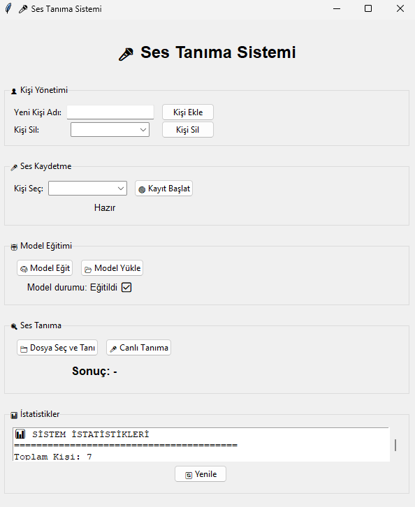

<p align="center">
  
</p>

# 🗣️ Speech Recognition With Python

<p align="center">
  
  
  
  
</p>

---

## 🚀 Proje Özeti

**Speech Recognition With Python**: Ses kaydı, kişi tanıma ve ses veritabanı yönetimi sağlayan, tamamen Python ile geliştirilmiş modern bir masaüstü uygulamadır. Kendi ses veritabanınızı oluşturun, konuşmacıları tanıyın ve makine öğrenimi ile güçlü modeller eğitin!

---

## 🛠️ Teknik Özellikler

- **Ana Arayüz (`main_app.py`)**
  - Modern ve kullanıcı dostu Tkinter GUI
  - Kişi ekleme, silme, ses kaydı, model eğitimi, tanıma ve istatistikler
  - Kişi silme: Tüm veriler eksiksiz temizlenir

- **Ses Kaydedici (`voice_recorder.py`)**
  - Yüksek kaliteli ses kaydı ve oynatma
  - Kayıtları listeden seçip dinleyebilme

- **Ses Özellikleri (`voice_features.py`)**
  - MFCC, spektral, chroma, pitch, tempo ve daha fazlası
  - Detaylı analiz ve görselleştirme

- **Veritabanı & Model (`speaker_database.py`)**
  - Kişi/ses örneği ekleme, silme, özellik çıkarımı
  - SVM, Random Forest, XGBoost, LightGBM ile otomatik en iyi model seçimi
  - Class balancing ve veri artırma altyapısı
  - Tüm bilgiler ve modeller dosya tabanlı olarak saklanır

- **Klasör Yapısı**
  - `recordings/` : Ses kayıtları
  - `voice_database/speakers/` : Kişi bazlı ses ve özellik dosyaları
  - `voice_database/models/` : Model dosyaları
  - `voice_database/metadata.json` : Metadata

---

## ✨ Yenilikler & Güncellemeler

- 🔥 Kişi silme özelliği: Tüm veriler eksiksiz silinir
- 🧹 Güven oranı kaldırıldı, sade ve net sonuç
- 🧠 Model kalitesi: Daha fazla algoritma, class balancing, gelişmiş özellik çıkarımı
- 🛡️ Hata yönetimi ve kod sadeleştirmeleri

---

## 📦 Kurulum & Kullanım

```bash
# Gerekli paketleri yükleyin
pip install -r requirements.txt

# Ana uygulamayı başlatın
python main_app.py
```

- Kişi ekleyin, ses kaydedin, modeli eğitin ve tanıma işlemlerini arayüzden yönetin.
- Tüm veriler ve modeller dosya tabanlı olarak saklanır.

---

## 📚 Ekstra Bilgiler

- Proje Python 3.10+ ile uyumludur.
- Büyük veri ve çoklu kişi desteği vardır.
- Kodlar ve arayüz tamamen özelleştirilebilir.

---

<p align="center">
  <b>💡 Kendi ses veritabanını oluştur, konuşmacıları tanı, makine öğrenimi ile geleceğe ses ver!</b>
</p>
